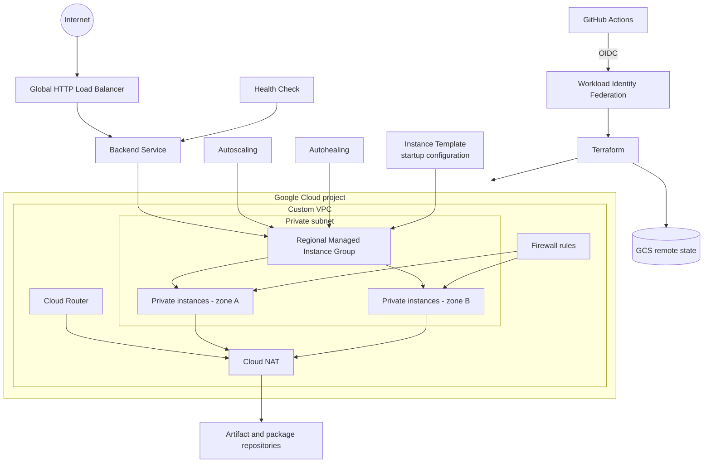

# GCP Highly Available Web Tier

Terraform reference architecture for a regional, autoscaled Compute Engine web tier behind a global external HTTP Application Load Balancer. Application instances use private IP addresses only and reach package repositories through Cloud NAT.

> This is an educational starting point, not a turnkey production platform. Review security, reliability, compliance, and cost requirements before deployment.

## Architecture

Traffic follows: Internet → Global HTTP Load Balancer → Backend Service → Regional Managed Instance Group → private instances.



The regional MIG distributes instances across multiple zones. Autoscaling adjusts capacity from CPU utilization, while a health check drives load-balancer routing and autohealing. Firewall rules permit HTTP only from Google load-balancer/health-check ranges and optionally permit SSH through IAP.

## What this project demonstrates

- Custom VPC, private subnet, Cloud Router, and Cloud NAT
- Private Shielded VMs created from an immutable instance template
- Multi-zone regional MIG with proactive updates, autoscaling, and autohealing
- Global external managed HTTP load balancing and health checking
- Least-privilege runtime identity, OS Login, and restricted ingress
- GCS remote state and keyless GitHub Actions authentication through WIF
- Automated formatting, validation, planning, and environment-gated deployment

## Repository structure

```text
.
├── .github/workflows/terraform.yml  # CI/CD workflow
├── scripts/startup.sh               # nginx and health endpoint setup
├── backend.tf                       # reusable GCS backend block
├── backend.hcl.example              # safe backend template
├── compute.tf                       # template, MIG, health check, autoscaler
├── iam.tf                           # instance identity and project IAM
├── load_balancer.tf                 # global HTTP load balancer
├── network.tf                       # VPC, subnet, NAT, and firewalls
├── services.tf                      # required API activation
├── variables.tf                     # inputs and validation
└── terraform.tfvars.example         # safe example configuration
```

## Prerequisites

- Terraform 1.7 or newer (CI uses 1.13.5)
- Google Cloud CLI for authentication and bootstrap operations
- A billing-enabled GCP project
- A globally unique GCS state bucket
- For CI: a GitHub repository, WIF pool/provider, and deployment service account

For local authentication:

```bash
gcloud auth application-default login
```

## Required GCP APIs

Terraform enables Compute Engine and IAM. Bootstrap identities should enable all required APIs first:

```bash
gcloud services enable \
  compute.googleapis.com iam.googleapis.com \
  iamcredentials.googleapis.com serviceusage.googleapis.com \
  sts.googleapis.com --project=YOUR_GCP_PROJECT_ID
```

## Required IAM roles

Exact permissions depend on organization policy. A straightforward deployment identity generally needs:

- `roles/compute.admin`
- `roles/iam.serviceAccountAdmin`
- `roles/resourcemanager.projectIamAdmin`
- `roles/serviceusage.serviceUsageAdmin`
- `roles/iam.serviceAccountUser`
- GCS object permissions on the backend bucket (commonly `roles/storage.objectAdmin`)

The VM identity receives only `roles/logging.logWriter` and `roles/monitoring.metricWriter`. Prefer a custom deployment role beyond demonstrations.

## Terraform backend setup

Create the state bucket separately, with uniform bucket-level access, versioning, suitable encryption, restricted IAM, and optionally retention protection.

```bash
gcloud storage buckets create gs://YOUR_TERRAFORM_STATE_BUCKET \
  --project=YOUR_GCP_PROJECT_ID --location=YOUR_GCP_REGION \
  --uniform-bucket-level-access
gcloud storage buckets update gs://YOUR_TERRAFORM_STATE_BUCKET --versioning
cp backend.hcl.example backend.hcl
terraform init -backend-config=backend.hcl
```

Edit `backend.hcl` with the real bucket. It is ignored by Git. Never commit state.

## WIF setup

Create a pool/provider that trusts GitHub's OIDC issuer, maps repository claims, and restricts its attribute condition to the exact repository and trusted branch or environment. Grant that external principal `roles/iam.workloadIdentityUser` on the deployment service account.

Configure these GitHub repository or environment variables:

| Variable | Purpose |
| --- | --- |
| `GCP_PROJECT_ID` | Target project ID |
| `GCP_WORKLOAD_IDENTITY_PROVIDER` | Full provider resource name |
| `GCP_SERVICE_ACCOUNT` | Deployment service account email |
| `TF_STATE_BUCKET` | GCS state bucket name |
| `TERRAFORM_ENVIRONMENT` | Optional GitHub environment; defaults to `development` |

See [DEPLOYMENT.md](DEPLOYMENT.md) for placeholder-only bootstrap commands.

## GitHub Actions workflow

Pull requests and pushes to `main` run format checking, initialization, validation, and planning. Successful plans are briefly retained as artifacts. Pushes to `main` can reach the apply job; protect the configured GitHub environment with required reviewers. Authentication uses short-lived WIF credentials, not a service-account key.

## Configuration variables

| Variable | Required | Default | Description |
| --- | --- | --- | --- |
| `project_id` | Yes | — | Target GCP project ID |
| `name` | No | `ha-web` | Resource name prefix |
| `region` | No | `us-central1` | Regional location |
| `zones` | No | three regional zones | At least two zones in `region` |
| `subnet_cidr` | No | `10.10.0.0/24` | Private subnet CIDR |
| `machine_type` | No | `e2-micro` | VM machine type |
| `source_image` | No | Debian 12 family | Boot image |
| `min_replicas` | No | `2` | Minimum MIG size |
| `max_replicas` | No | `6` | Maximum MIG size |
| `cpu_target` | No | `0.6` | Autoscaling target |
| `enable_iap_ssh` | No | `false` | Permit IAP SSH |
| `labels` | No | See `variables.tf` | Resource labels |

## Deployment instructions

```bash
cp terraform.tfvars.example terraform.tfvars
# Replace placeholders in terraform.tfvars and backend.hcl.
terraform init -backend-config=backend.hcl
terraform fmt -check -recursive
terraform validate
terraform plan -out=tfplan
terraform apply tfplan
```

Always review the saved plan. See [DEPLOYMENT.md](DEPLOYMENT.md) for more detail.

## Verification instructions

```bash
terraform output -raw load_balancer_ip
terraform output -raw website_url
curl "$(terraform output -raw website_url)"
curl "$(terraform output -raw website_url)/healthz"
```

Provisioning and health propagation can take several minutes. Verify that the backend is healthy and MIG instances span at least two zones.

## Destroy instructions

The state bucket is bootstrapped separately and is not destroyed here.

```bash
terraform plan -destroy -out=destroy.tfplan
terraform apply destroy.tfplan
```

Review the destroy plan and follow your retention policy for state objects.

## Security considerations

- This example serves HTTP. Add DNS, a managed certificate, HTTPS, and HTTP redirection for production.
- Restrict WIF to intended repositories/refs and protect deployment environments.
- Scope backend access narrowly and treat state and plans as sensitive.
- Instances have no public IPs; IAP SSH is disabled by default.
- Startup package installation is convenient but not reproducible; production should use tested images or signed artifacts.
- Pin and review providers and GitHub Actions, and meet organization logging and vulnerability-management requirements.

See [SECURITY.md](SECURITY.md) for reporting and guidance.

## Cost warning

This creates billable resources: at least two VMs, a global load balancer, Cloud NAT, an external IPv4 address, logging, and GCS operations/storage. Free-tier eligibility is not guaranteed. Review the [Google Cloud Pricing Calculator](https://cloud.google.com/products/calculator) and configure budgets before deployment.

## Troubleshooting

- **Backend initialization:** verify `backend.hcl`, bucket access, and use `terraform init -reconfigure -backend-config=backend.hcl` after changes.
- **WIF authentication:** verify the full provider name, service account email, claim mappings, repository condition, and IAM binding.
- **API/permission errors:** enable the APIs above and compare deployment roles with requested operations.
- **Unhealthy backends:** verify health-check firewall ranges, startup logs, nginx, and the 180-second initial delay.
- **No outbound access:** confirm Cloud NAT uses the correct subnet and region.
- **Zone validation:** use at least two zones, all belonging to `region`.

## Contributing, license, and disclaimer

Contributions are welcome; read [CONTRIBUTING.md](CONTRIBUTING.md). Licensed under [Apache License 2.0](LICENSE).

This project is provided “AS IS,” without warranties or guarantees. You are responsible for adapting it to your security, compliance, availability, data-protection, and operational requirements.
